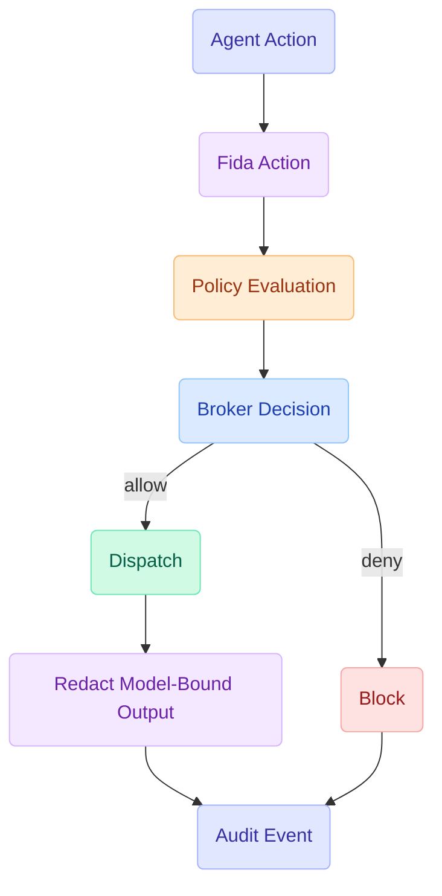

Fida is a local-first secret leak prevention layer for AI coding agents. It installs local agent integrations, verifies that synthetic secrets are redacted or safely blocked, scans the repository for risk, and records redaction-safe audit events that never leave your machine.

Its sharpest job is guarding **IDE-embedded agents** — OpenCode, Cursor, Claude Code, Copilot, Windsurf — that act through their _own_ file and shell tools. Fida routes those operations through a redacting gateway, an assertive skill, and (where supported) a hook that stops native tools when their output would expose detected secrets.

## The wedge: guarding IDE-embedded agents

A policy cannot redact output from a tool Fida never sees. Fida closes that gap with layers that stack:

1. **Gateway MCP tools** — `fida mcp serve` exposes `fida_read` / `fida_shell`. Every call runs policy → execute → redact → audit. A **PathJail** resolves symlinks and `..` first, so `/etc/passwd`, `~/.ssh/id_rsa`, and `../../secrets/.env` remain outside the workspace boundary. Inside the workspace, sensitive files return redacted safe views by default.
2. **Skill (steering)** — an always-included rules file telling the agent it MUST route reads/commands through Fida and must not bypass redaction.
3. **preToolUse hook** — the hard-block layer before an agent's _native_ tools. On Claude Code and Codex it denies a native read when secret content is detected, then redirects the agent to the redacting gateway. `fida status` and `fida doctor` report each agent as `enforced`, `best_effort`, `incomplete`, or `inactive`.

### Honest limit

Fida's MVP promise is narrow and testable: **secret values are redacted before reaching the model**. It is a strong guardrail, not a perfect OS sandbox. The gateway, skill, and hook define the sanctioned path and narrow bypasses; an agent that ignores all three still needs OS-level controls. For defense in depth, `FIDA_SANDBOX=1` wraps gateway shell commands with platform sandboxing (Seatbelt / bubblewrap) to network-isolate them and block secret-store reads.

## The three pillars

- **Secret Guard** (`fida init`, `fida mcp serve`, hooks) — install agent integrations, verify redaction with synthetic credentials, and report protection coverage.
- **Secret Scan** (`fida scan`) — surface repository secret risk and whether raw values can still reach a detected agent.
- **Audit** (`fida audit`, `fida report`) — answer "what did the agent do?" with structured, append-only event logs.

## What Fida solves

AI coding agents can inspect code, edit files, run commands, install packages, call MCP tools, and reach the network. Those powers need boundaries that are explicit, reviewable, and local.

Fida makes agent work:

- Secret-safe: `.env`, keys, and credentials are redacted by default before they reach a model; strict policies can block the path entirely.
- Explicit: risky actions resolve to `allow`, `ask`, `deny`, or `dry-run`.
- Reviewable: sessions produce structured audit events and reports.
- Policy-extensible: advanced repository permissions live in YAML when you need them.
- Local-first: scan, audit, and setup data stay on your machine.
- Agent-agnostic: one permission layer can guard many clients.

### What Fida guards

| Surface   | What you control                                                 |
| --------- | ---------------------------------------------------------------- |
| Commands  | Exact, prefix, regex, working directory, risk, and environment.  |
| Files     | Read and write allowlists, ask rules, and hard denies.           |
| Secrets   | Model-bound redaction, suspicious diff blocking, and scan risk.  |
| Network   | Domains, hosts, CIDRs, private ranges, and metadata endpoints.   |
| MCP tools | Tool allow, ask, and deny patterns before calls reach a server.  |
| Sessions  | Audit logs, diffs, reports, cleanup, and apply gates.            |

## How it works

Mediation is deterministic: every action follows one path, evaluated in a fixed order.

### Core loop

Every mediated action follows the same path:



The policy engine evaluates actions through a fixed order:

1. Built-in hard denies.
2. Secret detection.
3. Explicit deny rules.
4. Explicit allow rules.
5. Explicit ask rules.
6. Profile default decision.
7. Global default decision.

## Get started

Install protection, verify redaction, and scan the repository:

```bash
fida init
```

Check which agents are enforced, best-effort, incomplete, or inactive:

```bash
fida status
```

Inspect repository secret risk and raw-secret exposure:

```bash
fida scan
```

Add a repository policy only when you need advanced allow/ask/deny rules:

```bash
fida init --policy
fida policy check
```

Check what is wired and where the gaps are:

```bash
fida doctor
```
